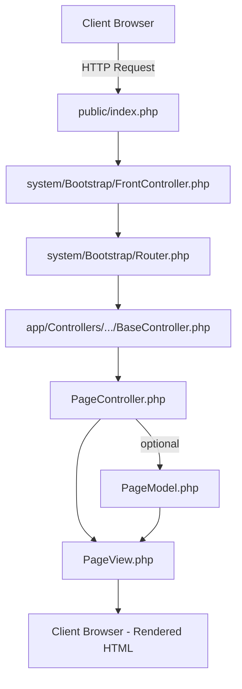

# bsg.world_backend

Backend codebase for **bsg.world**.  
This repository contains everything that makes the site work **on the server side** (without the frontend source): form handlers, Telegram notifications, email autoreplies, and other backend logic. It is effectively a **production snapshot** of the backend files copied from the live hosting environment.


## 🧭 Repository Scope

- **Backend only** — no frontend source code is stored here.
- **Built assets present** — CSS/JS/HTML bundled by the frontend repo and deployed here for serving.
- **Production snapshot** — a direct copy of the backend files from the live host of **bsg.world**.


## 🧱 Key Principles

The backend is a **custom lightweight MVC** designed specifically for **bsg.world**.  
It follows a modular, extensible structure with a clear separation of responsibilities.

- **Single entry point** — all dynamic HTTP requests are redirected to `public/index.php` via  `.htaccess` rules located in the project root.  
  This ensures clean URLs and centralized request handling.
- **Routing control** — `.htaccess` also restricts direct access to PHP files (except `public/index.php`), allows serving static assets, and enforces UTF-8 charset.
- **Separation of concerns** — routing, business logic, and views are isolated and independent.
- **Environment awareness** — development, testing, and production behaviour is configured centrally.
- **Configurability** — domains, database credentials, and path aliases are defined in `app/Config/Constants.php` and `app/Config/Paths.php`.
- **Extendability** — new features can be added with minimal changes to routes, controllers, or models.
- **Lightweight and dependency-free** — no external frameworks; the system runs entirely on pure PHP for maximum control and performance.


## 🧰 Tech Stack

- **PHP**: **8.2.x recommended** (stable 8.x series)  
- **MySQL**: relational database used by the site (SQL queries live in the backend)
- **Built frontend assets**: CSS / JS / HTML produced by the shared frontend repo:  
  `websites_frontend_shared` → `npm run build`  
  <https://github.com/BSG-websites/websites_frontend_shared>

---

## 📁 Project Structure

The backend follows a modular MVC pattern with access-level–based directories (`all`, `auth`, `admin`, `public`, etc.).  
Each level contains its own set of Controllers, Models, and Views.  
Global utilities and helpers are stored in `app/Utils/`, while configuration files are centralised in `app/Config/`.

```plaintext
.
├── app/                              # Core application logic
│   ├── Config/                       # Constants and global path definitions
│   │   ├── Constants.php             # Domain, DB, paths, keys, etc.
│   │   └── Paths.php                 # Path aliases used across the project
│   │
│   ├── Controllers/                  # Route-level logic and request handlers
│   │   ├── all/                      # Controllers for open/public routes
│   │   ├── auth/                     # Controllers requiring authentication
│   │   ├── BaseController.php        # Common logic loader for all controllers
│   │   └── HomeController.php        # Example controller for homepage
│   │
│   ├── Models/                       # Business logic and DB interaction
│   │   ├── all/                      # Models for public access level
│   │   ├── auth/                     # Models for authenticated users
│   │   ├── PagesTemplates.php        # Page-templating model (shared logic)
│   │   └── Home.php                  # Example model for homepage
│   │
│   ├── Routes/                       # Route declarations and request mapping
│   │
│   ├── Utils/                        # Helpers and third-party libraries
│   │   ├── user-access-levels.php    # Access control for folders (auth, admin, etc.)
│   │   ├── xhr-responses.php         # Centralised AJAX/HTTP response helpers
│   │   ├── telegram-bot.php          # Telegram notification integration
│   │   ├── email-sender/             # Email-sending helper (mailer)
│   │   └── other-helpers...          # Various utility scripts (date, geo, etc.)
│   │
│   └── Views/                        # HTML/PHP templates for rendering responses
│       ├── all/                      # Templates for all access levels
│       ├── auth/                     # Templates for authenticated users
│       ├── home/                     # Homepage templates
│       ├── ua.php                    # Ukrainian version
│       └── en.php                    # English version
│
├── public/                           # Public web root
│   ├── assets/                       # Compiled static assets (CSS, JS, images, fonts)
│   └── index.php                     # Single entry point; all dynamic requests routed here
│
├── system/                           # Core framework files
│   ├── Bootstrap/
│   │   ├── FrontController.php       # Initializes and dispatches application flow
│   │   └── Router.php                # Custom routing system (maps URIs to controllers)
│   ├── Database/
│   │   └── Database.php              # Database abstraction layer and query builder
│   └── Environment/
│       └── Environment.php           # Defines environment mode (dev/test/prod)
```

## 🧩 Access-Level Logic Overview

Access control is managed through `app/Utils/user-access-levels.php`.  
Depending on the declared access type in the route (`public`, `auth`, `admin`, etc.),  
the framework dynamically loads the corresponding **Controller**, **Model**, and **View** from matching subdirectories inside `app/`.

Example of simplified logic:

```php
function checkingUserAccessLevel($type)
{
    switch ($type) {
        case "public":
            return true; // open access
        case "auth":
            // check session, validate user ID in database, etc.
            break;
        case "admin":
            // allow access only for admin users
            break;
    }
}
```

Each access level represents a separate context of the application with its own routing and security boundaries:

* `all/` — modules accessible to everyone.
* `public/` — pages open to anonymous visitors.
* `auth/` — controllers and views available only to authenticated users.
* `admin/` — restricted area for administrators or staff.


## ⚙️ How It Works Internally

The request lifecycle inside the backend follows a clean sequential flow:

```text
index.php
   ↓
FrontController.php
   ↓
Router.php
   ↓
BaseController.php
   ↓
PageController.php  → (optionally calls) → PageModel.php
   ↓
PageView.php
```

1. **`public/index.php`** – the single entry point; all dynamic requests are redirected here via `.htaccess`.
2. **`system/Bootstrap/FrontController.php`** – bootstraps the environment and starts dispatching.
3. **`system/Bootstrap/Router.php`** – resolves the requested URI and determines which controller and method to load.
4. **`app/Controllers/.../BaseController.php`** – acts as a bridge: loads global utilities, templates, and common logic.
5. **`PageController.php`** – handles page-specific logic; may call **Models** for data or processing.
6. **`PageModel.php`** – optional layer encapsulating business logic and DB queries.
7. **`PageView.php`** – renders the final HTML output and returns it to the client.


## 🧭 Request Flow Diagram



This diagram visualises how every incoming HTTP request is processed inside the `bsg.world_backend`,
from the first entry point to the final rendered output.


## 🧩 Core Layers

The backend follows a clear **layered MVC architecture** with separation between routing, logic, data, and presentation.

- **🧭 Routing Layer**
  - `Router.php` resolves incoming HTTP requests.
  - Maps URIs to controllers and actions defined in `app/Routes/`.
  - Applies access-level rules (e.g. `public`, `auth`, `admin`) before dispatching.

- **🧩 Controllers**
  - Handle requests, validate input, and manage workflow between layers.
  - Invoke the appropriate model methods to fetch or process data.
  - Pass processed results to the corresponding view for rendering.

- **📊 Models**
  - Encapsulate **domain logic** and **business rules**.
  - Interact with the database via `system/Database/Database.php`.
  - Contain reusable query methods and data transformations.

- **🎨 Views**
  - Responsible for rendering HTML or JSON responses.
  - Use dynamic PHP templates located under `app/Views/`.
  - Include localization variants (e.g., `ua.php`, `en.php`).

- **🛠 Utilities & Config**
  - Reusable helpers and third-party integrations (`app/Utils/`).
  - Project constants and path definitions (`app/Config/Constants.php`, `Paths.php`).
  - Environment management for different deployment contexts (`system/Environment/Environment.php`).


Each layer is **loosely coupled**, ensuring modularity and maintainability —  
new features can be implemented by extending only the relevant controller, model, and view without modifying the rest of the system.

---

## ✉️ Form Handling & Notifications

This section describes how the backend processes form submissions, sends automatic replies to users,  
and delivers real-time submission notifications to Telegram.


## 1️⃣ Email Autoreply to User

When a visitor submits a form, the backend automatically sends a confirmation (autoreply) email to the address they provided.

**Implementation details:**

- Email credentials are stored in `app/Config/Constants.php`:
  - `GMAIL_USER` — sender address (Gmail account)
  - `GMAIL_APP_PASS` — Gmail App Password for SMTP authentication
- All form submissions are handled by  
  `app/Controllers/public/FormController.php`, which calls logic from  
  `app/Models/public/Forms/Forms.php`.
- Emails are sent using **PHPMailer v6.10.0**, located at  
  `app/Utils/libs/PHPMailer/`.
- The helper responsible for sending emails is  
  `app/Utils/email-sender.php`, which:
  - Connects to Gmail via SMTP (using `GMAIL_USER` and `GMAIL_APP_PASS`).
  - Sends an **autoreply email** to the user confirming their submission.


## 2️⃣ Telegram Notifications for Admins

Each form submission also triggers a Telegram notification sent to the internal admin group.

**Implementation details:**

- Telegram configuration is stored in `app/Config/Constants.php`:
  - `TG_BOT_TOKEN` — Telegram bot token
  - `TG_GROUP_ID` — chat/group ID where notifications are sent
- Message sending is handled by  
  `app/Utils/telegram-bot.php`.
- The message text (form data, timestamps, etc.) is assembled in  
  `app/Controllers/public/FormController.php`.


## 🧠 Processing Algorithm Overview

Below is the simplified lifecycle of a form submission:

1. User clicks the **Submit** button on a frontend form.  
2. The backend **validates** submitted data.  
3. The data is **stored** in the corresponding MySQL table  
   (`form_[form_name]_requests`).  
4. The backend **composes** a Telegram message summarising the submission.  
5. The message is **sent to Telegram** via the configured bot.  
6. An **autoreply email** is sent to the user confirming successful submission.


## 🔄 Example Flow (Simplified)

```mermaid
sequenceDiagram
    participant U as User (Browser)
    participant F as FormController
    participant M as Forms.php (Model)
    participant DB as MySQL
    participant T as Telegram Bot
    participant E as Email Sender

    U->>F: Submit form
    F->>M: Validate & process data
    M->>DB: Insert new record
    F->>T: Send Telegram notification
    F->>E: Send autoreply email to user
    E-->>U: Confirmation email delivered
````


> 🧩 **Note:**
> Both Telegram and Gmail credentials are configured in `Constants.php`.
> To migrate the system, ensure these environment constants are correctly updated in the new environment before deployment.